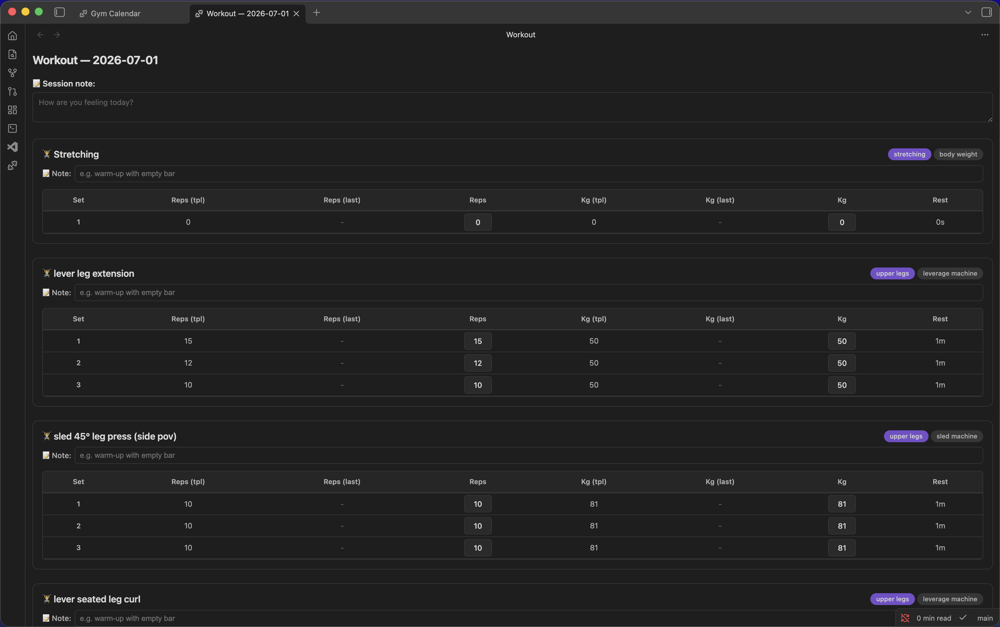

  
  <h1>🏋️‍♂️ Gym Workout Tracker for Obsidian</h1>
  
<b>Your completely private, friction-free fitness companion right inside your second brain.</b>

  
  
  

 

**Gym Workout Tracker** is a sleek, powerful Obsidian plugin designed to track your fitness journey seamlessly. With a built-in database of 1,300+ exercises, interactive templates, and beautiful calendar visualizations, logging your workouts has never been this smooth.

Zero vault clutter, zero subscriptions, and complete offline privacy. 

---

## ✨ Features That Do The Heavy Lifting

  

 

- 📅 **Interactive Calendar:** A gorgeous monthly calendar that marks your workout days with subtle indicators. Just click a date to jump straight into logging!

  

- 📚 **1,300+ Exercises Database:** Search and autocomplete from a massive database of exercises. Includes **exercise names and tags** for equipment and muscle groups.
- 📋 **Smart Templates:** Build reusable templates like "Push Day", "Legs", or "Cardio". Reorder exercises effortlessly with drag-and-drop.
- 📈 **"Last Time" Auto-Fill:** Let the app remember for you. Every new set automatically pre-fills your numbers from the last session so you always know what you need to beat.
- 💾 **Clutter-Free Auto-Save:** You don't have to save a dozen markdown files per week. Everything lives in a single JSON file behind the scenes, leaving your vault perfectly clean.
- 🔌 **Obsidian Graph Integration:** Toggle an option to have your workout data file appear right in your Obsidian Graph View!

<!-- 

  

  -->

---

## 🚀 Quick Start

Logging your first workout takes literally 10 seconds:

1. Click the **dumbbell icon** in your Obsidian ribbon, or use the Command Palette to run `Open gym calendar`.
2. Click on **Today's Date**.
3. **Pick a Template** (or create a new one on the fly).
4. Tap out your sets, reps, and weights. Everything saves instantly as you type!

---

## 📦 Installation

### 1. Community Plugins (Recommended)
You can find the plugin straight from Obsidian:
- Open Obsidian Settings -> **Community plugins**
- Make sure "Safe mode" is **off**
- Click **Browse** and search for **Gym Workout Tracker**
- Click Install and then **Enable**

### 2. Manual Installation
If you prefer doing things manually or want the absolute bleeding-edge version:
1. Download the latest `main.js`, `styles.css`, and `manifest.json` from the [Releases page](https://github.com/Piero24/obsidian-gym-tracker/releases).
2. Create a folder named `gym-workout-tracker` inside your `.obsidian/plugins/` directory.
3. Place the downloaded files into that folder.
4. Reload Obsidian and enable the plugin in your settings.

---

## ⚙️ Customization

Head over to the plugin settings to tweak the app to your liking:
- **Unit Swapping:** Easily switch between `kg` and `lbs`. All past data will mathematically convert automatically!
- **First Day of the Week:** Choose between Sunday or Monday to match your calendar habits.
- **Storage Strategy:** By default, data is saved hidden in plugin settings. But you can easily point it to a Vault file (e.g., `.gym-tracker/data.md`) so it seamlessly syncs via Obsidian Sync, iCloud, or Git.

---

## 🤝 Credits

The massive exercise database (names, categories, equipment, and tags) included in this plugin is sourced from the fantastic [exercises-dataset](https://github.com/hasaneyldrm/exercises-dataset) by [Hasan Eylül Drm](https://github.com/hasaneyldrm). 

**Enjoying the plugin? Leave a star on the repo! ⭐**
